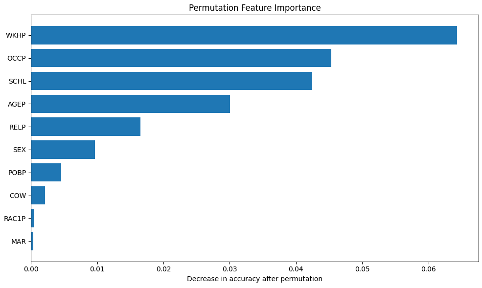
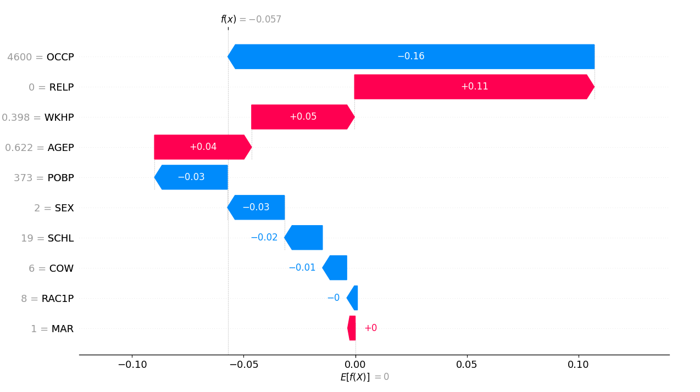
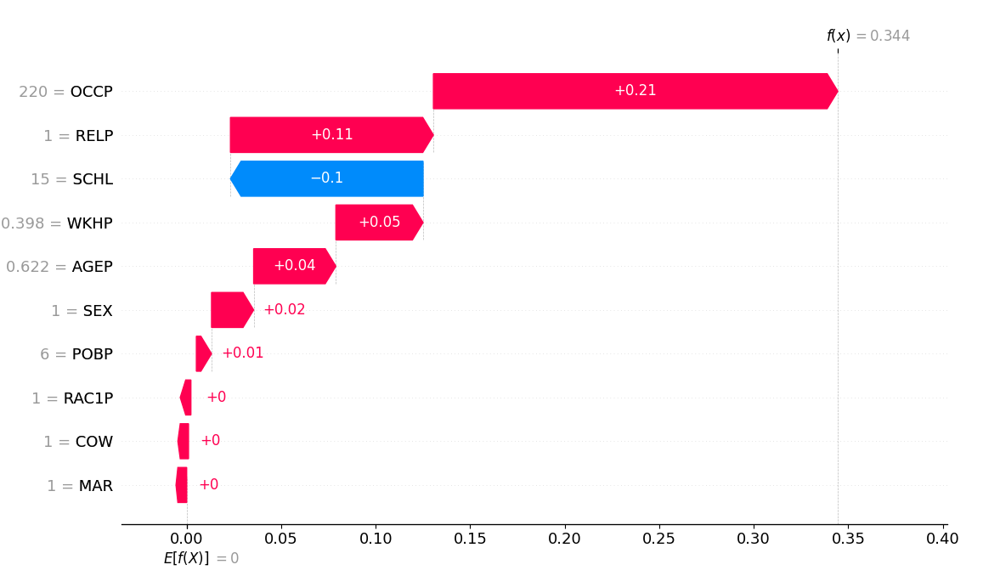
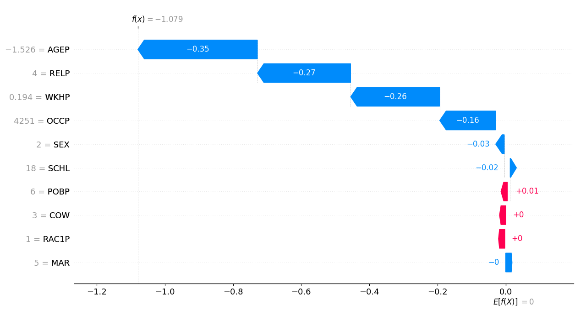
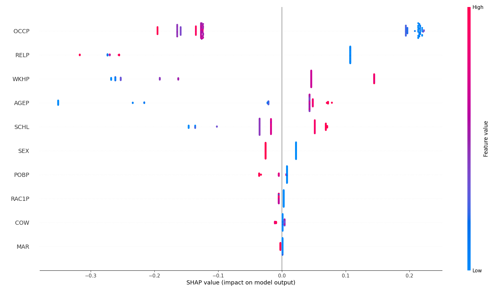
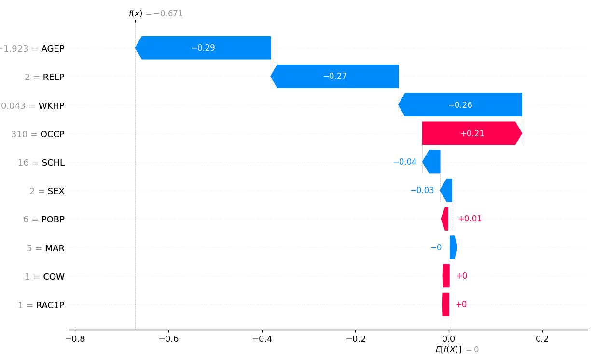
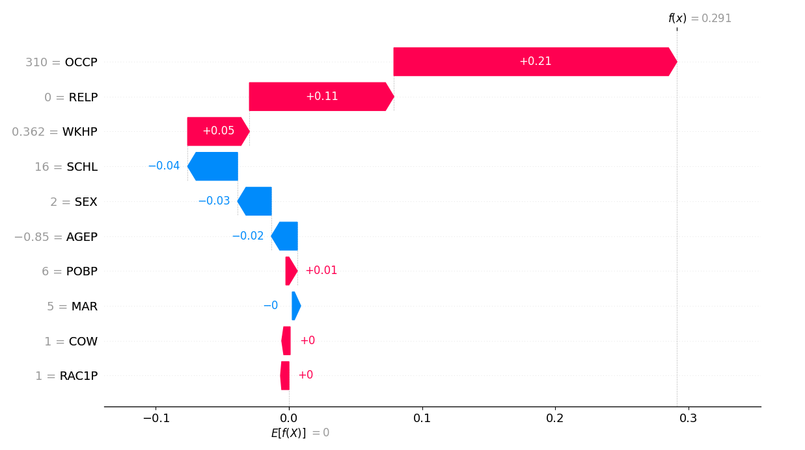

#######################################################################
# BAKRI Sara
# #######################################################################

## Jeu de données : pré-traitement

**Donnez la liste des features et ce qu'elles représentent (préciser les éventuels changements effectués en pré-traitement ou si pas de changement)**

On doit déterminer le type des différentes features et leur distribution. 

OCCP : *Occupation (Catégorique nominal)*
  - Très grand nombre de catégories, avec une distribution où quelques professions sont très fréquentes et de nombreuses professions rares.

AGEP : *Age (Numérique)*
  - 2 pics : les jeunes actifs, et les bientot retraité.e.s

SCHL : *Educational attainment (Catégorique ordinal)*
  - Sur-représentation sur le niveau étude supérieur

MAR : *Marital status (Catégorique nominal)*
  - Beaucoup de personne mariées
  - Quelques divorcées ou non-mariées
  - Les personnes séparées ou veuves sont rares

COW : *class of worker (Catégorique nominal)*
  - Secteur privé prédomine
  - Presques aucun "working without pay for family business or farm¨
  - Pas de personnes au chomage

RELP : *Relationships (Catégorique nominal)*
  - Majoritairement des liens de parenté directe
  - Quelques colocataires

WKHP : *Hours worked per week (Numérique)*
  - 40-hour work week mostly

SEX : *Sex (Catégorique binaire)*
  - Un peu plus d'hommes que de femmes

RAC1P : *Race (Catégorique nominal)*
  - Majorité blanche

Plusieurs distribution sont fortement déséquilibrées, certaines modalités étant très majoritaires. 
Il n'y a pas de valeurs manquantes.

On estime aussi la correlation des features entre elles mais aussi avec les labels. Cela nous aidera pour savoir quelle features garder.

Les corrélations les plus fortes :
-  MAR - AGEP = 0.45
- MAR - RELP = 0.4
Pas de colinéarité excessives qu'il faudrait éliminer

Les features où la correlation avec labels est très proche de 0. On fait le choix de les retirer
-  COW: corr with label = 0.0526
-  POBP: corr with label = -0.0864

Features numériques: (Par soucis de método, les arbres de décision fonctionnent par seuil donc pas nécessaire)
- AGEP : Allure gaussienne - StandardScaling
- WKHP : Non gaussinne - MinMaxScaling


## Expérimentation 1 : Comparaison de modèles par défaut

* Jeux de données utilisé : 
  * Taille ensemble d'entrainement (nb lignes et nb colonnes) : 0.7 * 166315 = 116420
  * Taille ensemble de test (nb lignes et nb colonnes) : 0.3 * 166315 = 49894 

* Résultats (hyper-paramètres par défaut)

|  Evaluation en train | Random Forest | Adaboost       | XGBoost       |
|----------------------|---------------|----------------|---------------|
|  accuracy            |0.9983         | 0.8043         |0.8157         | 
|  Temps calcul        |9.908s         |1.685s          |8.775s         |
|  Matrice confusion   |[[68587, 117]  |[[57828, 10876] |[[58463, 10241]|
|                      |[77, 47639]]   |[11905, 35811]] |[11217, 36499]]|


|  Evaluation en test  | Random Forest | Adaboost       | XGBoost       |
|----------------------|---------------|----------------|---------------|
|  accuracy            |0.8102         | 0.8047         |0.8151         |
|  Matrice confusion   |[[24980, 4428] |[[24753, 4655]  |[[24985, 4423] |
|                      |[5027, 15460]] |[ 5090, 15397]] |[4805, 15682]] |

* Commentaires et Analyse : 


Pour RandomForest, accuracy très élevée en entraînement (0.9983) mais chute significative en test (0.8102), indiquant un overfitting important. Démultiplication des Faux positifs et faux négatifs sur la matrice de confusion. Ce modèle est aussi le plus lent à train. AdaBoost contraste fortement avec les deux autres modèle en termes de temps d'entrainement (1.685s contre 9.908s et 8.775s)

Ada Boost a une accuracy en entraînement (0.8100) et en test (0.8095) très proches, ce qui indique une bonne généralisation et quasi absence d’overfitting. Temps d’entraînement très faible (7.823s), avantageux pour itérations rapides et optimisation d’hyperparamètres. Encore beaucoup de Faux négatifs, le déséquilibre des classe impact pas mal les perfomances. 

Enfin sur XGBOOST, accuracy en entraînement (0.8157) et en test (0.8151) proches, indiquant également une bonne capacité de généralisation. Temps d’entraînement intermédiaire (8.775s). La matrice de confusion meilleur compromis sur la classification des classes, avec un peu moins de faux négatifs (4805) que Random Forest et AdaBoost.

## Expérimentation 2 : Comparaison Modèles ML par défaut
* Jeux de données utilisé : 
  * Taille ensemble d'entrainement (nb lignes et nb colonnes) : 0.7 * 10000 = 7000
  * Taille ensemble de test (nb lignes et nb colonnes) :  0.3 * 10000 = 3000

### Random Forest (RF)
* Processus d'entrainement : 
  * Recherche des hyperparamètres
   * Listes des hyperparamètres testés et valeurs : 
        - "n_estimators": [50, 100, 200]
          - Nombre d’arbres dans la forêt. Plus d’arbres peuvent améliorer la performance mais augmentent le temps de calcul.
        - "max_depth": [None, 5, 10, 20]
          - Profondeur maximale des arbres. Limiter la profondeur aide à éviter l'over-fitting.
        - "min_samples_split": [2, 5, 10]
          - Nombre minimum d’échantillons pour diviser un noeud. Augmenter cette valeur réduit l'over-fitting.
        - "min_samples_leaf": [1, 2, 4]
          - Nombre minimum d’échantillons dans une feuille terminale. Permet de contrôler la complexité du modèle.

  * Nombre de plis pour la validation croisée :
        cross validation folds = 5

  * Nombre total d'entrainement :
      nb_total = (number of hyperparameters values tested) * numbe of cv folds
      nb_total = 3 * 4 * 3 * 3 * 5 = 540 iterations

* Résultats : 
  * Meilleurs hyperparamètres : 
      {'max_depth': 20, 'min_samples_leaf': 1, 'min_samples_split': 2, 'n_estimators': 200}
  * Performances en entraintement : 
      * Accuracy : 0.9052
      * Temps d'entrainement : 31.134s
      * Temps de calcul : 5.677s
      * Matrice de Confusion : 
          [[65964  2740]
          [ 1914 45802]]

  * Performance en test : 
      * Accuracy : 0.8195
      * Temps de calcul :  2.537s
      * Matrice de Confusion : 
          [[25031  4377]
          [ 4629 15858]]

- Accuracy train : 0.9983 -> 0.9052

L’accuracy a légèrement diminué après optimisation, le modèle par défaut était très performant mais en over-fitting.

- Accuracy test : 0.8102 -> 0.8195

L’accuracy pour le test set s’améliore, signe que le fine-tuning des hyperparamètres réduit l'overfitting. 

- Temps de calcul : 9.908s -> 19.275s

L’augmentation du temps s’explique par le nombre plus important d’arbres (n_estimators=200).

Le nombre de faux positifs et faux négatifs en test diminue légèrement, ce qui montre un meilleur équilibre dans la classification.

### ADABOOST 
* Processus d'entrainement : 
  * Recherche des hyperparamètres
   * Listes des hyperparamètres testés et valeurs : 
      - "n_estimators": [50, 100, 200]
        - Nombre d’arbres faibles successifs. Plus d’arbres améliore la performance mais augmentent le temps de calcul.
      - "learning_rate": [0.01, 0.1, 1]
        - Taux d’apprentissage qui contrôle l’impact de chaque arbre. Un petit taux nécessite plus d’arbres mais réduit le risque d'over-fitting.

  * Nombre de plis pour la validation croisée : 
        cross validation folds = 5

  * Nombre total d'entrainement :
      nb_total = (number of hyperparameters values tested) * numbe of cv folds
      nb_total = 3 * 3 * 5 = 45 iterations

* Résultats : 
  * Meilleurs hyperparamètres : 
      {'algorithm': 'SAMME', 'learning_rate': 1, 'n_estimators': 200}

  * Performances en entraintement : 
      * Accuracy : 0.8100
      * Temps d'entrainement : 12.716s
      * Temps de calcul : 1.086s
      * Matrice de Confusion : 
          [[58362 10342]
          [11782 35934]]

  * Performance en test : 
      * Accuracy : 0.8095
      * Temps de calcul : 0.485s
      * Matrice de Confusion : 
              [[24861  4547]
              [ 4959 15528]]

- Accuracy train : 0.8043 -> 0.8100

L’amélioration est faible.

- Accuracy test : 0.8047 -> 0.8095

Une légère amélioration, principalement due à l’augmentation du nombre d’arbres (n_estimators=200) et du learning_rate = 1.

- Temps de calcul : 1.685s -> 7.823s

L’augmentation est proportionnelle au nombre d’arbres testés.

Réduction légère des faux négatifs, mais la répartition reste proche du modèle par défaut. Adaboost est sensible aux valeurs du learning_rate et du nombre d’arbres. Ici, l’optimisation a surtout stabilisé la performance sans gains massifs.

### XGBOOST
* Processus d'entrainement : 
  * Recherche des hyperparamètres
  * Listes des hyperparamètres testés et valeurs : 
      - "n_estimators": [50, 100, 200]
        - Nombre d’arbres construits.
      - "max_depth": [3, 5, 7]
        - Profondeur maximale des arbres.
      - "learning_rate": [0.01, 0.1, 0.2, 1]
        - Taux d’apprentissage. Des valeurs plus faibles permettent un apprentissage plus progressif.
      - "subsample": [0.5, 0.7, 1.0]
        - Fraction des données utilisées pour chaque arbre. Permet de réduire le sur-apprentissage.

* Nombre de plis pour la validation croisée : 

* Nombre total d'entrainement : 
    nb_total = (number of hyperparameters values tested) * numbe of cv folds
    nb_total = 3 * 3 * 4 * * 3 * 5 = 540 iterations


* Résultats : 
  * Meilleurs hyperparamètres : 
      {'learning_rate': 0.1, 'max_depth': 5, 'n_estimators': 200, 'subsample': 0.7}

  * Performances en entraintement : 
      * Accuracy : 0.8364
      * Temps d'entrainement : 51.875s
      * Temps de calcul : 
      * Matrice de Confusion : 
          [[59297  9407]
          [ 9635 38081]]

  * Performance en test : 
      * Accuracy : 0.8258
      * Temps de calcul : 51.875s
      * Matrice de Confusion : 
           [[25068  4340]
            [ 4352 16135]]

- Accuracy train : 0.8157 -> 0.8364

Une augmentation modérée, le modèle exploite mieux les données après optimisation.

- Accuracy test : 0.8151 -> 0.8258

L’optimisation améliore la généralisation. L’accuracy test est maintenant légèrement supérieure à RF et ADABOOST, ce qui montre un très bon compromis biais/variance.

- Temps de calcul : 8.775s -> 51.875s

Le temps de calcul est fortement augmenté à cause de la combinaison d’hyperparamètres (notamment n_estimators=200 et subsample=0.7) et de la validation croisée.

Les faux positifs et faux négatifs sont équilibrés et inférieurs à ceux d’Adaboost, montrant une meilleure précision globale et un meilleur rappel.

XGBoost est performant et robuste, mais coûteux en temps de calcul pour l’optimisation complète.

## Expérimentation 3 : Comparaison des "meilleurs modèles

* Jeux de données utilisé : 
  * Taille ensemble d'entrainement (nb lignes et nb colonnes) : 0.7 * 166315 = 116420 
  * Taille ensemble de test (nb lignes et nb colonnes) : 0.3 * 166315 = 49894

* Résultats des meilleurs modèles obtenus dans Expe 2

|  Evaluation en train | Random Forest | Adaboost       | XGBoost       |
|----------------------|---------------|----------------|---------------|
|  accuracy            |0.9600         |0.8100          |0.8578         | 
|  Temps calcul        |19.275s        |7.823s          |70.711s        |
|  Matrice confusion   |[[68587, 2740] |[[58362, 10342] |[[60454, 8250] |
|                      |[1914, 45802]] |[11782, 35934]] |[8307, 39409]] |


|  Evaluation en test  | Random Forest | Adaboost       | XGBoost       |
|----------------------|---------------|----------------|---------------|
|  accuracy            |0.8195         |0.8095          |0.8265         |
|  Matrice confusion   |[[25031, 4377] |[[24861, 4547]  |[[25095, 4313] |
|                      |[4629, 15858]] |[ 4959, 15528]] |[4346, 16141]] |


## Expérimentation 4 : inférence sur un autre jeu de données (optionnel)

```
--- Train set evaluation ---

Predict time     : 0.774s
Accuracy         : 0.7721
Precision        : 0.6874
Recall           : 0.8242

Confusion Matrix:
[[9443 3400]
 [1595 7476]]

--- Test set evaluation ---

Predict time     : 0.402s
Accuracy         : 0.7742
Precision        : 0.6900
Recall           : 0.8285

Confusion Matrix:
[[4039 1452]
 [ 669 3232]]

----------- Cross-Validation Evaluation -----------

CV folds         : 5
Mean Accuracy    : 0.7865
Mean Precision   : 0.7481
Mean Recall      : 0.7296

Confusion Matrix:
[[4524  967]
 [1061 2840]]
```

Les performances du modèle AdaBoost se détériore lorsque l'on change de dataset pour passer sur celui du Colorado, avec une accuracy de 0.7742.
La précision (0.6900) et le recall (0.8285) indiquent que le modèle identifie correctement une bonne partie des cas positifs, mais avec un certain nombre de faux positifs.

On remarque quelques particularités sur ce nouveau dataset : la population est moins diversifiée racialement (RAC1P majoritairement blanche), POBP est concentré sur peu de lieux et certaines variables comme AGEP ou SCHL présentent des distributions différentes. Ces particularités ont tendance à fausser les résultats du modèle, qui apprend certaines interactions spécifiques à la Californie qui ne se reproduisent pas totalement dans le Colorado.


## Expérimentation 5 : impact de la taille du jeu de données

Full dataset = 166316 entries

### RandomForest

```
--- Train set evaluation ---

Train time       : 22.895s
Predict time     : 4.245s
Accuracy         : 0.9983
Precision        : 0.9977
Recall           : 0.9982

Confusion Matrix:
[[68595   109]
 [   85 47631]]

--- Test set evaluation ---

Predict time     : 1.925s
Accuracy         : 0.8147
Precision        : 0.7788
Recall           : 0.7664

Confusion Matrix:
[[24949  4459]
 [ 4786 15701]]
```

### AdaBoost

```
--- Train set evaluation ---

Train time       : 22.244s
Predict time     : 1.881s
Accuracy         : 0.8100
Precision        : 0.7765
Recall           : 0.7531

Confusion Matrix:
[[58362 10342]
 [11782 35934]]

--- Test set evaluation ---

Train time       : 22.244s
Predict time     : 0.960s
Accuracy         : 0.8095
Precision        : 0.7735
Recall           : 0.7579

Confusion Matrix:
[[24861  4547]
 [ 4959 15528]]


```

Pour Random Forest on vois clairement une grosse différence de performance pour un dataset plus grand.

Avec le full dataset, le modèle Random Forest atteint une accuracy extrêmement élevée sur le train (0.9983), un precision et recall proches de 1. Cependant, ceci est du à l'over-fitting. On le voit sur la performance sur le test qui chute drastiquement (accuracy 0.8147, recall 0.7664). La matrice de confusion montre un nombre important de faux négatifs et faux positifs en test, alors que le modèle était théoriquement parfait en train. Le temps d’entraînement et de prédiction augmente également (train time ~23s, predict time ~4s), montrant le coût significatifs d’un grand dataset pour RandomForest.

L’augmentation des données n’a pas corrigé l'over-fitting mais a plutôt exacerbé la différence train/test. 

AdaBoost est beaucoup plus stable face à la taille du dataset, probablement parce que chaque itération n’ajoute qu’un arbre faible, ce qui limite la complexité du modèle et réduit le risque d'over-fitting. Il semble mieux adapté à des jeux de données larges.

La taille du dataset influe différemment selon les modèles : pour des modèles complexes comme Random Forest, l’augmentation des données peut révéler ou exacerber l’overfitting, tandis que des modèles comme AdaBoost restent robustes et généralisent mieux.


## Modèle choisi pour la suite : 
* quel modèle : On choisi notre AdaBoost model 
Il offre le meilleur compromis entre légèreté d'execution et capcité de généralisation
 

## Explicabilité : "permutation feature importance"
 
* Résultats obtenus : 



* Principe de notre implémentation :

La méthode de Permutation Feature Importance consiste à mesurer l’impact de chaque attribut sur les performances du modèle.

On calcule d’abord la performance de référence du modèle.

Pour chaque attribut, on permute aléatoirement ses valeurs dans le jeu de données, ce qui détruit toute relation entre cet attribut et la cible.

On évalue à nouveau le modèle sur ce jeu de données modifié.

La diminution de performance par rapport à la performance de référence est interprétée comme l’importance de l’attribut. Plus la performance chute, plus l’attribut est important pour le modèle.

On répète la permutation plusieurs fois pour obtenir une estimation stable et moyenne de l’importance de chaque attribut.

* Analyses :

WKHP a la plus grande permutation feature importance. C'est la feature la plus déterminante pour le label final.
Viennent ensuite, a un sore d'importance a peu près équivalent, l'age, le niveau d'étude, et l'occupation. On retrouve enfin les feature les moins importante dont le sexe et la race et le statur marital. 

## Explicabilité : avec LIME et SHAP

* Méthode LIME

```
Sample #37502:
SCHL <= 16.00: -0.0546
0.32 < WKHP <= 0.40: 0.0292
1.00 < SEX <= 2.00: -0.0242
OCCP > 5540.00: -0.0240
-0.05 < AGEP <= 0.82: 0.0221
0.00 < RELP <= 1.00: 0.0168
POBP > 212.00: -0.0162
RAC1P <= 1.00: 0.0080
MAR <= 1.00: 0.0051
COW <= 1.00: 0.0022
```

SCHL, contribution négative
WKHP, contribution positive
SEX, OCCP, AGEP : influences modérées

Faible niveau d’éducation pénalise la probabilité d'une prédiction positive
Travailler plus d’heures augmente la probabilité d'une prédiction positive

```
Sample #8415:
WKHP > 0.40: 0.0546
OCCP <= 2014.00: 0.0410
1.00 < SEX <= 2.00: -0.0259
RELP <= 0.00: 0.0237
19.00 < SCHL <= 21.00: 0.0214
-0.85 < AGEP <= -0.05: 0.0116
POBP <= 6.00: 0.0090
RAC1P <= 1.00: 0.0048
MAR <= 1.00: 0.0020
COW <= 1.00: -0.0008
```
WKHP > 0.40, forte contribution positive
OCCP <= 2014, contrivution positive
SEX, contribution négative

Association encore entre le nombre d'heures travaillées et la prédiction positive. L'occupation joue aussi un rôle important. 

```
Sample #28304:
SCHL > 21.00: 0.0511
RELP > 2.00: -0.0318
1.00 < SEX <= 2.00: -0.0282
0.32 < WKHP <= 0.40: 0.0244
-0.05 < AGEP <= 0.82: 0.0240
POBP <= 6.00: 0.0115
RAC1P <= 1.00: 0.0077
1.00 < COW <= 3.00: 0.0059
2014.00 < OCCP <= 4110.00: 0.0044
1.00 < MAR <= 5.00: -0.0042
```

SCHL > 21, contribution très positive
RELP > 2, contribution négative
AGEP, WKHP, légère contribution positives

LIME met en évidence des règles locales cohérentes. Les décision sont dominées le niveau d'éducation, le nombre d'heures travaillées, la profession, mais peuvent variés localement 

* Méthode SHAP

Les variables dominantes sont similaires à LIME : OCCP, WKHP, SCHL, RELP, AGEP



Dans notre échantillons on a un exemple négatif où l'occupation a une forte contribution négative sur le résultat. RELP, WKHP et AGEP qui sont élevées pousse une contribution positive mais qui est moindre comparée à OCCP.




Un autre exemple positif est marquée par une contribution positive de presque tous ses features (à valeur élevées) sauf SCHL qui est bas.




Une exemple négatif y ressemble. Les contribution négatives de AGEP, RELP, WKHP, qui ont des valeurs bassent, se valent presque.


* Comparaison LIME et SHAP

Les analyses SHAP et LIME conduisent globalement à des conclusions cohérentes quant aux variables influençant les prédictions du modèle, notamment le niveau d’éducation (SCHL), le nombre d’heures travaillées (WKHP), l’âge (AGEP) et la profession (OCCP). LIME fournit des explications locales intuitives, mais fortement dépendantes du voisinage échantillonné autour de chaque individu, ce qui peut entraîner une certaine instabilité des résultats. À l’inverse, SHAP qui repose sur une décomposition additive théoriquement fondée, garantis une attribution plus stable et cohérente des contributions des variables. 

LIME est plus pertinent pour une compréhension rapide et locale des décisions, tandis SHAP offre une analyse plus robuste et fiable, particulièrement adaptée à l’interprétation globale du modèle et à l’identification de biais ou de comportements systématiques.

* Analyse summary-plot de SHAP



Features dominantes :
WKHP
OCCP
RELP
AGEP
AHL

On retrouve les features citées précédement comme très influente. Les valeurs basses de OCCP ont une contribution nettement positive, et celles élevées une contribution négative. Ensuite RELP se distingue par une contribution positives pour les valeurs basses, mais il y a certaine valeurs basse de REPL auquelles le modèle associe une contribution négative. WKHP est très nettement séparé entre contribution positive pour les valeurs hautes, et contribution négative pour les valeurs basses et moyennes. AGEP a une forte contribution négative lorsque sa valeur est basse, et une certaine contribution positive lorsque sa valeur est haute. Enfin, SCHL a une contribution plutot symmétrique lorsque sa valeur est haute (contribution positive) et basse (contribution négative).

On dresse un profil où la profession joue un rôle primordiale pour la prédiciton du modèle. RELP également, de facon assez inattendu. WKHP suit un impact très intuitif où plus une personne travaille d'heure dans la semaine, plus la prédiction va tendre vers True. De même, l'age favorise la prédiction True, en exluant les personne trop jeunes. Et enfin, on a une certaine association entre niveau d'étude élévées et prédiction True. 

* Analyse par groupe

L’analyse des explications SHAP par sous-groupes (TP, TN, FP, FN) révèle des patterns intéressants et met en évidence des biais potentiels dans le modèle

Pour la catégorie FP, OCCP a le plus grand impact dans cette sous-catégorie. Le modèle surestime l'impact de OCCP pour une prédiciton positive, conduisant a des FP. L'association est trop rigide.
On remarque aussi qu'une partie de valeurs moyenne de WKHP contibue pas mal à la prédiction positives. Biaise le modèle et conduit à des faux positifs par inclusion de ces valeurs moyennes. De plus, pour RELP, l'association est beaucoup plus catégorique entre valeurs basse et contribution positives en comparaison avec le groupe de TP. Cela biaise encore plus le modèle. Pour FN, on voit que c'est de nouveau OCCP qui impact le plus, en surestimant l'impact négatifs de valeurs basses de OCCP. Les valeurs de OCCP qui ont un impact négatifs présentes une certaine dispersion verticales, indiquant une potentiel effet instable de celles, a relier avec la prédiction de faux négatifs. Le modèle segmente aussi beaucoup en fonction de WKHP, seules les valeurs très élévés sont associées à une contribution positives. AGEP est très catégoriquement associé à une contribution négatives dès que sa valeur est basse. On ne retrouve pas ca pour les TN. Pour les prédictions positives, une valeurs de WKHP basse n'est pas aussi strictement associée à un impact négatif sur la prédiction.  
Dans le groupe des TN, c'est RELP qui est devant en termes d'impact sur la prédiction. 

On observe par une dispersion verticale notable pour certaines features (OCCP, WKHP, RELP), indiquant que l’impact d’une même feature varie selon l’échantillon et la valeur de la feature. Cette variabilité contribue aux erreurs FP et FN et révèle un effet instable de certaines features.
Certaines features peuvent donc être trompeuses. WKHP a un très gros effet sur la prédiction finale, de meme pour OCCP qui présente une grande hétérogéneité des valeurs. 
Cela peut conduire à des faux négatifs et faux positifs selon les échantillons spécifiques. 

## Explicabilité : contrefactuelle

On va cherche à inverser l'impact des feature qui influencent le plus la prédiction. 



On a comme valeur de départ :

```
AGEP,COW,SCHL,MAR,OCCP,POBP,RELP,WKHP,SEX,RAC1P
18.0,1.0,16.0,5.0,310.0,6.0,2.0,35.0,2.0,1.0

```

On va chercher un inverser l'impact de AGEP, RELP et WKHP, pour que leur contribution soit positive.

On constate dans les explications LIME :

```
WKHP <= 0.15: -0.1036
0.15 < WKHP <= 0.52: 0.0451

AGEP <= -0.65: -0.0407
AGEP > 0.27: 0.0280

RELP > 1.00: -0.0342
RELP <= 0.00: 0.0160

```

On modifie les valeurs des features (en s'aidant d'autres entries de notre dataset qui valident les conditions pour une contribution positive).
On teste avec les valeurs :

AGEP = 30, RELP = 0.0,WKHP = 50.0

```
AGEP,COW,SCHL,MAR,OCCP,POBP,RELP,WKHP,SEX,RAC1P
30.0,1.0,16.0,5.0,310.0,6.0,0.0,50.0,2.0,1.0

```



On bien réussi à inverser la prédiction.